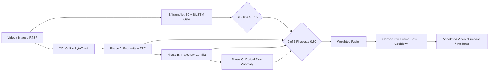

# UYIR — Multi-Stage Spatio-Temporal Hybrid Accident Detection System

A production-ready Intelligent Transportation System (ITS) pipeline in Python for real-time road accident detection from CCTV feeds, uploaded video, and still images. The system combines a **DL hard gate** (EfficientNet-B0 + BiLSTM), a **three-phase kinematic pipeline** (proximity/TTC, trajectory conflict, optical-flow anomaly), and a **weighted fusion engine** with alert gating.

All tunable thresholds live in [`config.py`](config.py).

---

## System Architecture



### Pipeline stages

1. **Object detection** — YOLOv8 (`yolov8n.pt`) for `person`, `car`, `bike`, `bus`, `truck`.
2. **Multi-object tracking** — YOLOv8 built-in **ByteTrack** (`bytetrack.yaml`) with 30-frame history (centroids, velocities, speed, bbox).
3. **Phase A — Proximity + TTC** — Euclidean distance gate (150 px vehicle–vehicle, 80 px vehicle–person) plus Time-To-Collision for converging pairs only.
4. **Phase B — Trajectory conflict** — Path intersection, IITH trajectory stop, emergency stop (independent of intersection), relative-velocity convergence, kinetic energy drop, spin/skid, bbox merge, occlusion. Post-crash stopped vehicles are kept via a **recently-moving** guard.
5. **Phase C — Anomaly confirmation** — Optical flow spike, bbox deformation, flow angular dispersion, and ≥3 consecutive anomalous frames.
6. **DL gate (Option 2)** — EfficientNet-B0 + BiLSTM + Attention on a 32-frame rolling buffer. `lstm_peak ≥ 0.55` must pass before phase signals are evaluated. CNN-LSTM weight in fusion is **0** (gate only).
7. **2-of-3 phase vote** — After the DL gate, at least **two** of Phase A / B / C must reach score ≥ 0.30.
8. **Score fusion** — Six weighted signals (trajectory stop, emergency stop, TTC, optical flow, flow dispersion). Optional XGBoost refinement when trained.
9. **Alert gating** — 3 consecutive confirmed frames + 20 s cooldown. Center risk zone applies a 1.15× score multiplier.

---

## Project Structure

```
accident-system/
├── app.py                      # FastAPI web dashboard (main entry point)
├── stream_processor.py         # Live camera / RTSP pipeline
├── config.py                   # All thresholds, weights, and paths
├── model.py                    # EfficientNet-B0 + BiLSTM + Attention
├── accident_detector.py        # Stream pipeline engine (same Option 2 logic as app.py)
├── data_logger.py              # CSV factor logger for threshold tuning
├── threshold_analyzer.py       # Plots CSV and suggests config updates
├── firebase_uploader.py        # Async Firebase / local JSON event upload
├── health_monitor.py           # Pi health heartbeat (FPS, CPU, RAM)
├── llm_vision_module.py        # Optional Ollama LLaVA accident-frame description
│
├── detection/yolo_module.py    # YOLOv8 wrapper
├── tracking/
│   ├── deepsort_module.py      # ByteTrack tracker for app.py (Track objects)
│   └── vehicle_tracker.py      # ByteTrack tracker for stream pipeline
├── phases/
│   ├── phase_a_proximity.py    # Proximity + TTC gate
│   ├── phase_b_trajectory.py   # Trajectory conflict + recently-moving guard
│   └── phase_c_anomaly.py      # Flow spike, deformation, dispersion
├── fusion/scoring.py           # Weighted fusion + congestion suppression
├── utils/                      # geometry, optical_flow, incident_clip, incident_store
├── templates/index.html        # Web dashboard UI
├── static/uploads/             # Processed media and incident clips
└── model_output/               # CNN-LSTM checkpoint, XGBoost model
```

> The `claude files/` folder contains outdated copies. Use the root-level modules listed above.

---

## Installation

1. **Clone the repository**
   ```bash
   git clone https://github.com/Kishorp28/accident-system.git
   cd accident-system
   ```

2. **Create a virtual environment**
   ```bash
   python -m venv venv
   source venv/bin/activate    # Linux / macOS
   # venv\Scripts\activate     # Windows
   ```

3. **Install dependencies**
   ```bash
   pip install torch torchvision numpy opencv-python fastapi uvicorn \
       ultralytics jinja2 python-multipart pillow xgboost scikit-learn pandas
   ```

4. **Optional**
   - `pip install firebase-admin` — cloud upload (place `firebase_key.json` in project root)
   - Ollama + LLaVA — LLM analysis of confirmed accident frames

Place the trained checkpoint at `model_output/accident_model.pth`. YOLO weights (`yolov8n.pt`) are downloaded automatically on first run.

---

## Running the Application

### Web dashboard

```bash
python app.py
```

Open [http://127.0.0.1:8000](http://127.0.0.1:8000).

**Dashboard capabilities:**
- **Image upload** — YOLO detection, proximity/occlusion scoring, DL probability, annotated JPEG output.
- **Video upload** — Full Option 2 pipeline with ByteTrack, telemetry overlay, H.264 annotated MP4, incident clip extraction, optional LLM analysis.
- **Streaming upload** — Real-time SSE frame preview via `/start-stream` + `/stream/{job_id}`.
- **XGBoost training** — Log labeled features from the UI, train with `/train-model`, view status at `/dataset-status`.
- **Incident history** — Saved clips and snapshots under `static/uploads/incidents`, listed via `/api/incidents`.

### Live camera pipeline

```bash
python stream_processor.py --source 0                          # webcam
python stream_processor.py --source rtsp://IP:PORT/stream        # RTSP
python stream_processor.py --source video.mp4 --no_display       # headless
```

### Threshold tuning

```bash
python data_logger.py --video clip.mp4 --label accident
python data_logger.py --video normal.mp4 --label normal
python threshold_analyzer.py --csv uyir_data_log.csv
```

---

## API Endpoints

| Method | Path | Description |
|--------|------|-------------|
| GET | `/` | Dashboard UI |
| POST | `/predict-image` | Upload image → detection + scoring + annotated JPEG |
| POST | `/predict-video` | Upload video → full pipeline + annotated MP4 + incidents |
| POST | `/start-stream` | Start background video job; returns `job_id` |
| GET | `/stream/{job_id}` | SSE stream of JPEG frames, metrics, and incidents |
| GET | `/api/incidents` | List saved incident records |
| DELETE | `/api/incidents/{id}` | Delete an incident record |
| GET | `/api/firebase/status` | Firebase connection status |
| POST | `/log-feature` | Append labeled feature row to `accident_features.csv` |
| POST | `/train-model` | Train XGBoost from CSV |
| GET | `/dataset-status` | Row counts and XGBoost active status |

### Example: `POST /predict-video` response

```json
{
  "class": "ACCIDENT",
  "confidence": 84.50,
  "trigger_phase": "DL + PHASE A & PHASE B Verified",
  "processed_video_url": "/static/uploads/processed_abc123.mp4",
  "accident_frame_url": "/static/uploads/accident_frame_xyz.jpg",
  "llm_analysis": "Two vehicles collided at the intersection center...",
  "incident_count": 1,
  "incidents": [{ "id": "...", "clip_url": "...", "snapshot_url": "..." }],
  "details": {
    "proximity_score": 0.85,
    "trajectory_score": 0.70,
    "flow_score": 0.60,
    "ttc_score": 0.85,
    "trajectory_stop_score": 1.0,
    "emergency_stop_score": 0.0,
    "relative_velocity_score": 0.0,
    "lstm_peak": 0.72,
    "cnn_lstm_prob": 0.68,
    "dl_confirmed": true,
    "phases_signalling": 2,
    "phase_a_confirmed": true,
    "phase_b_confirmed": true,
    "phase_c_confirmed": false
  }
}
```

---

## Key Configuration Defaults

| Parameter | Default | Purpose |
|-----------|---------|---------|
| `PROXIMITY_THRESHOLD` | 150 px | Vehicle–vehicle proximity gate |
| `PROXIMITY_PERSON_THRESHOLD` | 80 px | Vehicle–person proximity gate |
| `TTC_MAX_FRAMES` | 8 | Max frames until contact |
| `DL_GATE_THRESHOLD` | 0.55 | DL gate — must pass before phase vote |
| `DL_PHASE_SIGNAL_MIN` | 0.30 | Minimum score for a phase to count |
| `CONSECUTIVE_FRAMES` | 3 | Frames required before alert |
| `COOLDOWN_SECONDS` | 20 | Seconds between alerts |
| `FUSION_THRESHOLD` | 0.55 | Minimum fused score |

See [`config.py`](config.py) for the full list. For architecture details, algorithms, and research references, see [`tech_Des.md`](tech_Des.md).
