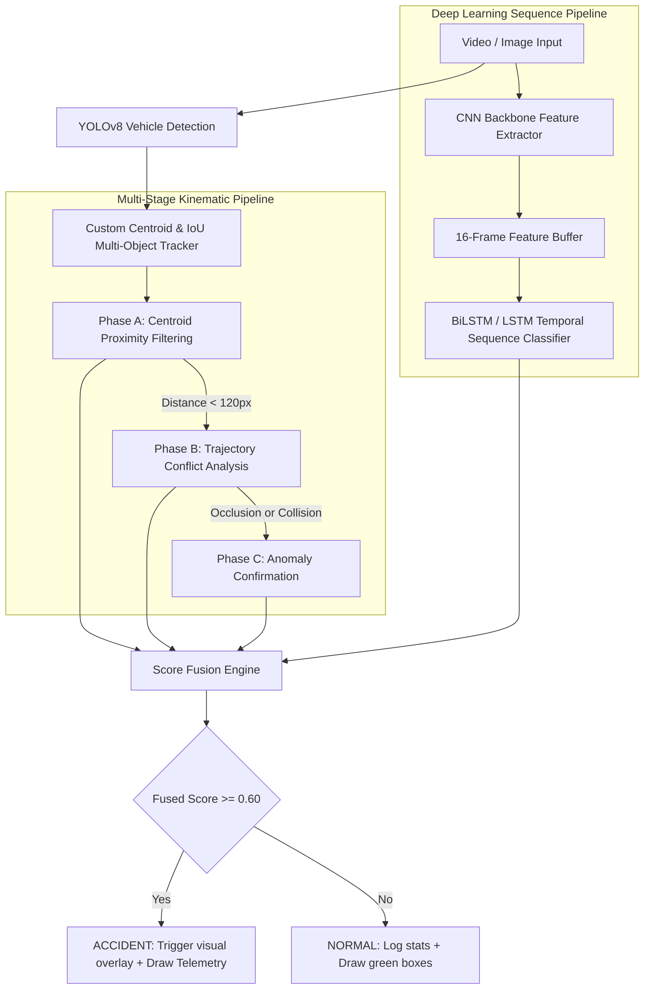

# Technical Description: Spatio-Temporal Hybrid Accident Detection System

This document provides a detailed technical breakdown of the architecture, modules, algorithms, and capabilities of the completed **Multi-Stage Spatio-Temporal Hybrid Accident Detection System**.

---

## 1. System Overview

The system is a production-ready Intelligent Transportation System (ITS) pipeline designed to identify road accidents from CCTV video streams and images. It fuses **heuristic geometric-kinematic reasoning**, **dense motion analysis**, and **deep learning sequence modeling** into a single, unified weighted decision engine.

---

## 2. Core Modules & Processing Pipeline

### 🟢 Module 1: Object Detection
* **Technology**: YOLOv8 (`ultralytics`)
* **Target Classes**: Cars, Motorcycles (bikes), Buses, and Trucks.
* **Mechanism**: Filters out unrelated classes (such as pedestrians, traffic lights, and animals) to reduce downstream spatial tracking overhead.
* **Outputs**: Class-specific bounding box coordinates `[x1, y1, x2, y2]` and detector confidence scores.

### 🔵 Module 2: Multi-Object Tracking (MOT)
* **Technology**: Custom Centroid & IoU Tracker (SORT-like tracker).
* **Mechanism**:
  * Calculates Intersection over Union (IoU) overlap matrices between existing active tracks and new YOLOv8 detections.
  * Solves greedy bipartite matching above an IoU threshold (default: `0.30`).
  * Spawns new tracks for unmatched detections; keeps tracks alive for a grace period of up to `10` frames (to handle brief visual occlusions).
  * Computes frame-by-frame velocity vectors `(vx, vy)` based on centroid displacements.
  * Archives historical trajectories (centroids) and bounding box sizes for the last `30` frames.

### 🟡 Phase A: Centroid Proximity Filtering
* **Purpose**: Serves as a high-speed computational gatekeeper.
* **Mechanism**:
  * Computes pairwise Euclidean distances between the centroids of all active tracked vehicles in each frame:
    $$d = \sqrt{(x_2 - x_1)^2 + (y_2 - y_1)^2}$$
  * If the distance is below a threshold (default: `120 pixels`), the pair is flagged for detailed trajectory conflict analysis.
  * Pairs exceeding the threshold are ignored, saving processing time.

### 🟠 Phase B: Trajectory Conflict Analysis
For vehicles flagged by Phase A, the system performs kinematic conflict tests:
1. **Trajectory Line Segment Intersection**:
   * Evaluates line segments formed by the history of both vehicles.
   * If their historical lines intersect, their paths have crossed, indicating a high conflict probability.
2. **Velocity Shift (Deceleration)**:
   * Compares recent average speeds (last 3 frames) to past average speeds (frames -6 to -3).
   * A sudden speed reduction of **70% or more** indicates a sudden stop (crash indicator).
3. **Deflection Angle Change**:
   * Measures the angular difference between historical travel vectors and the current vector using dot product geometry:
     $$\theta = \arccos\left(\frac{\vec{u} \cdot \vec{v}}{\|\vec{u}\| \|\vec{v}\|}\right)$$
   * A direction change of **greater than 40 degrees** indicates a sudden deflection or spin.
4. **Classification**:
   * **Collision**: Paths cross/near-cross and at least one vehicle decelerates or deflects abruptly.
   * **Occlusion**: Paths cross, but both vehicles maintain velocity and continue moving.

### 🔴 Phase C: Anomaly Confirmation Module
Validates suspected collisions using dense motion and physical signals:
* **Optical Flow Magnitude Spike**:
  * Computes dense Farneback optical flow ($dx, dy$) in grayscale between consecutive frames.
  * If the mean flow magnitude ($\sqrt{dx^2 + dy^2}$) inside a vehicle's bounding box spikes to **2.5x its historical average**, a motion spike is flagged (signifying sudden impact force or scattered debris).
* **Bounding Box Deformation**:
  * Measures changes in the vehicle's aspect ratio ($w/h$) and bounding box area ($w \times h$).
  * A change of **aspect ratio > 30%** or **area > 40%** indicates rollover, tilt, or crash deformation.
* **Multi-Frame Consistency**:
  * Anomaly flags must persist for at least **3 consecutive frames** to register, filtering out camera noise or sudden lighting changes.

### 🟣 CNN-LSTM Deep Learning Module
* **Backbone**: ResNet18 (ImageNet weights) + LSTM + Classifier.
* **Optimized Execution (Feature Caching)**:
  * Running the CNN backbone on 16 images for every frame is computationally expensive.
  * **Optimization**: The system extracts the 512-dimensional feature vector from the CNN for the current frame *once* and pushes it to a rolling queue of length 16.
  * The queue is stacked to shape `(1, 16, 512)` and fed directly into the LSTM and fully connected layers.
  * This optimization yields **16x faster inference speeds**, allowing the CNN-LSTM sequence model to run in real-time.

---

## 3. Weighted Score Fusion Engine

The decision engine combines all spatial and temporal signals into a unified accident score:

$$\text{Final Score} = w_1 \cdot S_{\text{prox}} + w_2 \cdot S_{\text{traj}} + w_3 \cdot S_{\text{flow}} + w_4 \cdot P_{\text{lstm}}$$

### Recommended Weights:
| Feature Weight | Component | Contribution Description |
| :--- | :--- | :--- |
| **$w_1 = 0.15$** | Proximity Score ($S_{\text{prox}}$) | How close the vehicles are (scaled 0.0 to 1.0). |
| **$w_2 = 0.30$** | Trajectory Score ($S_{\text{traj}}$) | Path intersections, deflections, and sudden stops. |
| **$w_3 = 0.20$** | Anomaly Score ($S_{\text{flow}}$) | Optical flow magnitude spikes and physical box deformation. |
| **$w_4 = 0.35$** | CNN-LSTM Prob ($P_{\text{lstm}}$) | Temporal deep learning probability from frame sequences. |

> [!IMPORTANT]
> If the **Final Score $\ge$ 0.60**, the system flags an **ACCIDENT** and lists the active triggering modules (e.g., *Phase B & CNN-LSTM DL Module*).

---

## 4. Operational Capabilities & Visual Feedback

When an accident is identified, the system creates visual annotations and saves them directly to the processed output video (encoded in native H.264 `avc1` for browser playback):

1. **Vehicle Bounding Boxes & IDs**: Drawn in green, changing to **Orange** for suspected anomalies and **Red** for confirmed anomalies.
2. **Trajectory Trails**: Dots showing the path history of each vehicle.
3. **Collision Centers**: A red target concentric circle showing the point of impact.
4. **Proximity Lines**: Yellow lines connecting vehicles that are dangerously close.
5. **Dashboard Telemetry Panel**: A translucent overlay showing live statistics (Frame count, active vehicles, and individual phase scores).
6. **Accident Alert Banner**: A red alert banner at the top of the frame indicating detection score and active triggers.
