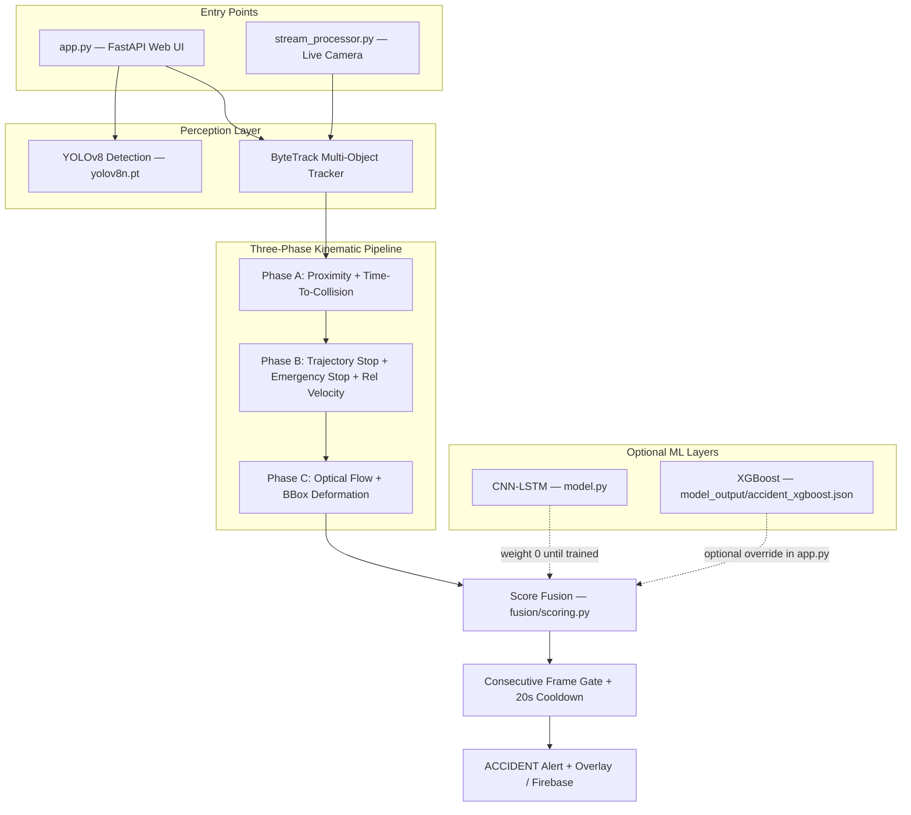

# Technical Description: Spatio-Temporal Hybrid Accident Detection System

This document describes the **current** architecture, modules, algorithms, and capabilities of the Multi-Stage Spatio-Temporal Hybrid Accident Detection System after the IITH/TTC/ByteTrack overhaul.

All tunable thresholds live in [`config.py`](config.py). Do not hardcode values in other files.

---

## 1. System Overview

The system is an Intelligent Transportation System (ITS) pipeline that identifies road accidents from CCTV video, uploaded files, and still images. It fuses **heuristic geometric-kinematic reasoning** (Phases A–C), **optional deep learning** (CNN-LSTM, XGBoost), and **alert gating** (consecutive-frame confirmation + cooldown) into a unified decision engine.

The project has **two entry points** that share the same phase logic:

| Entry point | File | Use case |
|-------------|------|----------|
| Web dashboard | `app.py` | Upload images/videos via browser, train XGBoost, view annotated output |
| Live stream | `stream_processor.py` | Webcam, RTSP camera, or video file with Firebase upload |



---

## 2. Project Directory Structure

```
accident-system/
├── app.py                      # FastAPI web server (main web entry point)
├── stream_processor.py         # Live camera / RTSP pipeline entry point
├── config.py                   # All thresholds, weights, and paths
├── model.py                    # ResNet18 + LSTM classifier
├── accident_detector.py        # Stream pipeline accident engine (wraps phases + fusion)
├── data_logger.py              # CSV factor logger for threshold tuning
├── threshold_analyzer.py       # Plots CSV and suggests config updates
├── firebase_uploader.py        # Async Firebase / local JSON event upload
├── health_monitor.py           # Pi health heartbeat (FPS, CPU, RAM)
├── llm_vision_module.py        # Optional Ollama LLaVA description of accident frame
│
├── detection/
│   └── yolo_module.py          # YOLOv8 wrapper (person + vehicle classes)
│
├── tracking/
│   ├── deepsort_module.py      # ByteTrack tracker for app.py (Track objects)
│   └── vehicle_tracker.py      # ByteTrack tracker for stream pipeline (TrackedVehicle)
│
├── phases/
│   ├── phase_a_proximity.py    # Phase A: distance + TTC gate
│   ├── phase_b_trajectory.py   # Phase B: IITH stop, emergency stop, rel velocity
│   └── phase_c_anomaly.py      # Phase C: flow spike, deformation, dispersion
│
├── fusion/
│   └── scoring.py              # Research-backed weighted fusion engine
│
├── utils/
│   ├── geometry.py             # Distance, TTC, line intersection, angles
│   └── optical_flow.py         # Farneback flow, frame diff, dispersion
│
├── templates/
│   └── index.html              # Web dashboard UI
│
├── static/uploads/             # Processed images and videos
├── model_output/               # CNN-LSTM checkpoint, XGBoost model, training history
└── accident_features.csv       # Labeled features for XGBoost training
```

> **Note:** The `claude files/` folder contains outdated copies of early modules. Use the root-level files listed above.

---

## 3. Core Modules & Processing Pipeline

### Module 1: Object Detection

* **File**: `detection/yolo_module.py`
* **Technology**: YOLOv8 (`ultralytics`), model `yolov8n.pt`
* **Target classes** (COCO IDs):

  | Class ID | Label |
  |----------|-------|
  | 0 | person |
  | 2 | car |
  | 3 | bike |
  | 5 | bus |
  | 7 | truck |

* **Confidence threshold**: `0.30` (`config.VEHICLE_CONF_THRESHOLD`)
* **Outputs**: Bounding boxes `[x1, y1, x2, y2]`, class label, confidence score

Person detection was added to support vehicle–pedestrian accident scenarios (tighter proximity threshold in Phase A).

---

### Module 2: Multi-Object Tracking (MOT)

* **Web app tracker**: `tracking/deepsort_module.py` — class `ByteTrackTracker` (aliased as `VehicleTracker`)
* **Stream tracker**: `tracking/vehicle_tracker.py` — class `VehicleTracker` with `TrackedVehicle` objects

Both use **YOLOv8 built-in ByteTrack** (`tracker="bytetrack.yaml"`, `persist=True`), which handles occlusions in crowded junction traffic better than the previous custom IoU tracker.

| Parameter | Value | Config key |
|-----------|-------|------------|
| Track history length | 30 frames | `TRACK_HISTORY_FRAMES` |
| Lost-track timeout | 30 frames | `TRACK_LOST_TIMEOUT` |
| Detection confidence | 0.30 | `VEHICLE_CONF_THRESHOLD` |

Each tracked object maintains:
* Centroid history (trajectory path)
* Velocity vectors `(vx, vy)` per frame
* Speed history (magnitude of velocity)
* Bounding box history (for deformation checks)

---

### Phase A: Proximity + Time-To-Collision (TTC)

* **File**: `phases/phase_a_proximity.py`
* **Purpose**: High-speed gatekeeper — only pairs that are close **and converging** proceed to Phase B

**Mechanism:**

1. **Euclidean distance** between centroids:
   $$d = \sqrt{(x_2 - x_1)^2 + (y_2 - y_1)^2}$$

2. **Pair-specific proximity threshold**:
   * Vehicle–vehicle: `150 px` (`PROXIMITY_THRESHOLD`)
   * Vehicle–person: `80 px` (`PROXIMITY_PERSON_THRESHOLD`)

3. **Time-To-Collision (TTC)** — computed in `utils/geometry.py`:
   * Relative closing speed must exceed `0.5 px/frame`
   * Pair must have TTC `< 8 frames` (`TTC_MAX_FRAMES`)
   * Parallel traffic (not converging) returns TTC = ∞ and is correctly ignored

4. **TTC score**: $\text{ttc\_score} = \max(0,\ 1 - \text{ttc}/8)$

5. **Static image fallback**: When velocity history is unavailable (single-frame image upload), distance-only gating is used.

**Output**: List of `(track1, track2, distance, ttc_score)` candidate pairs.

---

### Phase B: Trajectory Conflict Analysis

* **File**: `phases/phase_b_trajectory.py`
* **Purpose**: Distinguish real collisions from normal junction crossings and occlusions

**Signals checked for each Phase A candidate pair:**

| Signal | Function | Description |
|--------|----------|-------------|
| Trajectory intersection | Line segment intersection on 15-frame history | Paths crossed in recent frames |
| **Trajectory stop (IITH 2018)** | `check_trajectory_stop_after_intersection()` | After intersection, one vehicle's speed drops from >3.0 to <2.0 px/frame — collision, not occlusion |
| **Emergency stop** | `is_emergency_stop()` | 75%+ speed drop over 15-frame baseline in ≤3 frames (vs gradual braking) |
| **Relative velocity anomaly** | `relative_velocity_anomaly()` | Speed difference was >8.0 px/frame, now <2.0 — rear-end convergence |
| Kinetic energy drop | `check_ke_drop()` | Area × speed² drops >80%; uses emergency stop when applicable |
| Spin / skid | `check_spin()` | Circular variance of heading >0.15 over 5 frames |
| BBox merge | IoU > 0.60 | Two vehicles overlap as one box |
| Occlusion | Containment ratio > 0.60 | Smaller vehicle hidden inside larger |

**Classification rules:**

* **Collision**: `(intersection + trajectory_stop) OR emergency_stop OR relative_velocity_converged OR merge OR spin`
* **Occlusion**: Intersection or containment without collision signals — score suppressed (~0.20–0.30)
* **Normal**: No significant conflict

Intersection alone does **not** trigger a collision — this is the key fix for dense Indian junction traffic.

---

### Phase C: Anomaly Confirmation

* **File**: `phases/phase_c_anomaly.py`
* **Helpers**: `utils/optical_flow.py`

| Signal | Threshold | Description |
|--------|-----------|-------------|
| Optical flow magnitude spike | >2.5× rolling average | Sudden motion inside bbox (impact/debris) |
| BBox deformation | Aspect ratio >30% or area >40% change | Rollover, tilt, crash deformation |
| Flow angular dispersion | Std dev >45° | Chaotic radial scatter vs parallel traffic |
| Multi-frame consistency | ≥3 consecutive frames | Filters camera noise and lighting flicker |

---

### CNN-LSTM Deep Learning Module

* **File**: `model.py`
* **Architecture**: ResNet18 (ImageNet, 512-dim features) → LSTM (128 hidden) → 2-class classifier
* **Execution**: Feature caching — CNN runs once per frame; 16-frame rolling buffer fed to LSTM (16× faster than raw frame input)
* **Checkpoint**: `model_output/accident_model.pth`

> **Current fusion status**: CNN-LSTM weight is set to **0.0** in fusion until the model is trained on validated accident data (e.g. IITH dataset). Inference still runs in `app.py` for telemetry display and future re-enablement.

---

### XGBoost Classifier (Optional)

* **File**: `model_output/accident_xgboost.json`
* **Training data**: `accident_features.csv` (logged via web UI `/log-feature`)
* **Training endpoint**: `POST /train-model`
* When loaded, `app.py` uses XGBoost probability as the frame score instead of pure fusion (with Phase C + CNN low-confidence suppression gate).

---

## 4. Weighted Score Fusion Engine

* **File**: `fusion/scoring.py`
* **Config**: `config.FUSION_WEIGHTS`, `config.FUSION_THRESHOLD` (default `0.55`)

$$\text{Final Score} = \sum_{k} w_k \cdot s_k$$

| Weight | Signal | Description |
|--------|--------|-------------|
| **0.45** | Trajectory stop | IITH post-intersection stop — most precise signal |
| **0.20** | TTC critical | Time-To-Collision score from Phase A |
| **0.20** | Emergency stop | Sudden deceleration from Phase B |
| **0.08** | Optical flow | Phase C flow magnitude spike |
| **0.07** | Flow dispersion | Phase C angular scatter |
| **0.00** | CNN-LSTM | Disabled until trained on validated data |

**Congestion gate**: When traffic density >40% and average scene speed <5 px/frame (or stopped ratio >60%), proximity/TTC/trajectory/emergency signals are suppressed by 90% to reduce false positives in traffic jams.

**Decision**: `Final Score >= FUSION_THRESHOLD` → accident candidate for this frame.

---

## 5. Alert Gating (False Positive & Spam Prevention)

Applied in `app.py` (video) and `accident_detector.py` (stream):

| Gate | Value | Config key | Purpose |
|------|-------|------------|---------|
| Consecutive frame confirmation | 3 frames | `CONSECUTIVE_FRAMES` | Require sustained agreement before alert |
| Camera cooldown | 20 seconds | `COOLDOWN_SECONDS` | Suppress repeat alerts for same ongoing accident |

---

## 6. Entry Point: Web Application (`app.py`)

FastAPI server with Jinja2 dashboard at `http://127.0.0.1:8000`.

### API Endpoints

| Method | Path | Description |
|--------|------|-------------|
| GET | `/` | Dashboard UI (`templates/index.html`) |
| POST | `/predict-image` | Upload image → detection + proximity + CNN-LSTM + fusion/XGBoost |
| POST | `/predict-video` | Upload video → frame loop with ByteTrack, phases, fusion, annotated MP4 output |
| POST | `/log-feature` | Append labeled feature row to `accident_features.csv` |
| POST | `/train-model` | Train XGBoost from CSV and save to `model_output/` |
| GET | `/dataset-status` | Row counts and XGBoost active status |

### Video processing loop (per frame)

1. Resize frame (max width 800px), process every 2nd frame
2. ByteTrack update → active tracks
3. CNN-LSTM feature extraction (16-frame buffer, rolling LSTM peak)
4. Optical flow computation
5. Phase A → Phase B → Phase C scoring
6. `fuse_scores()` → optional XGBoost override
7. Intersection risk zone multiplier (1.2× for center 50% of frame)
8. Consecutive frame gate + cooldown check
9. Draw annotations, telemetry panel, write H.264 MP4 (`avc1`)
10. On confirmed accident: save worst frame, optional LLM analysis via `llm_vision_module.py`

### Telemetry panel (ITS SYSTEM MONITOR v3)

Displays per frame: TTC Critical, Trajectory Stop, Emergency Stop, Relative Velocity, Optical Flow, Flow Dispersion, Spin/Merge, Scene Interruption, consecutive frame counter.

---

## 7. Entry Point: Live Stream Pipeline (`stream_processor.py`)

For deployment on Raspberry Pi or server with a live camera feed.

```
Camera/RTSP → VehicleTracker (ByteTrack)
            → AccidentDetector (Phases A/B/C + Fusion)
            → Consecutive frame gate + Cooldown
            → FirebaseUploader (async) or local JSON fallback
            → HealthMonitor (30s heartbeat)
```

| Component | File |
|-----------|------|
| Tracker | `tracking/vehicle_tracker.py` |
| Detector | `accident_detector.py` |
| Cloud upload | `firebase_uploader.py` |
| Health heartbeat | `health_monitor.py` |

Optional Stage-1 YOLO accident model (`accident_model.pt`) gates frames before 3-phase verification if the file exists; otherwise 3-phase runs directly.

**Run:**
```bash
python stream_processor.py --source 0                          # webcam
python stream_processor.py --source rtsp://IP:PORT/stream       # RTSP
python stream_processor.py --source video.mp4 --no_display      # headless
```

---

## 8. Threshold Tuning Tools

| Tool | File | Usage |
|------|------|-------|
| Data logger | `data_logger.py` | `python data_logger.py --video clip.mp4 --label accident` |
| Threshold analyzer | `threshold_analyzer.py` | `python threshold_analyzer.py --csv uyir_data_log.csv` |

The analyzer plots accident vs normal distributions and prints suggested updates for `config.py` (`PROXIMITY_THRESHOLD`, `SPEED_DROP_PERCENT`, `OPTICAL_FLOW_SPIKE`, etc.).

---

## 9. Configuration Reference (`config.py`)

Key parameters for Coimbatore junction cameras (defaults):

```python
PROXIMITY_THRESHOLD       = 150    # px, vehicle-vehicle
PROXIMITY_PERSON_THRESHOLD = 80    # px, vehicle-person
TTC_MAX_FRAMES            = 8      # frames until contact
TRACK_LOST_TIMEOUT        = 30     # ByteTrack grace period (frames)
EMERGENCY_BASELINE_FRAMES = 15     # baseline for emergency stop detection
EMERGENCY_DROP_PERCENT    = 75.0   # % drop = emergency (not normal braking)
CONSECUTIVE_FRAMES        = 3      # frames required before alert
COOLDOWN_SECONDS          = 20.0   # seconds between alerts per camera
FUSION_THRESHOLD          = 0.55   # minimum fused score for accident
```

---

## 10. Operational Capabilities & Visual Feedback

When an accident is identified, the system produces:

1. **Bounding boxes & track IDs** — green (moving), darker green (stationary), orange/red (anomaly)
2. **Trajectory trails** — dot history per tracked object
3. **Proximity lines** — yellow lines between TTC-critical pairs
4. **Collision centers** — red concentric circles at impact point
5. **Intersection risk zone** — white rectangle over center 50% of frame (1.2× score multiplier)
6. **Telemetry panel** — live TTC, trajectory stop, emergency stop, flow scores
7. **Accident alert banner** — red overlay with confidence and active triggers
8. **Processed output** — H.264 MP4 or annotated JPEG in `static/uploads/`
9. **LLM analysis** (video, optional) — text description of worst accident frame via Ollama LLaVA or heuristic fallback

---

## 11. Run Commands

```bash
# Install dependencies
pip install torch torchvision numpy opencv-python fastapi uvicorn \
    ultralytics jinja2 python-multipart pillow xgboost scikit-learn pandas

# Web dashboard
python app.py
# → http://127.0.0.1:8000

# Live camera pipeline
python stream_processor.py --source 0

# Threshold tuning
python data_logger.py --video clip.mp4 --label accident
python threshold_analyzer.py --csv uyir_data_log.csv
```

Optional: `pip install firebase-admin` for cloud upload; place `firebase_key.json` in project root.

---

## 12. Research References

| Phase / Feature | Source |
|-----------------|--------|
| Phase A proximity | NJIT 2022 |
| Phase A TTC | Physics-based closing velocity |
| Phase B trajectory stop | IITH 2018 — intersection + stop = collision; intersection alone = occlusion |
| Phase B emergency stop | Extended baseline window (15 vs 6 frames) |
| Phase B relative velocity | Rear-end convergence detection |
| Phase C optical flow | HFG 2010 |
| Phase C flow dispersion | Fuzzy 2023 |
| ByteTrack | YOLOv8 built-in — occlusion-robust tracking |
| Fusion weights | Research-backed; LSTM disabled pending IITH training data |
