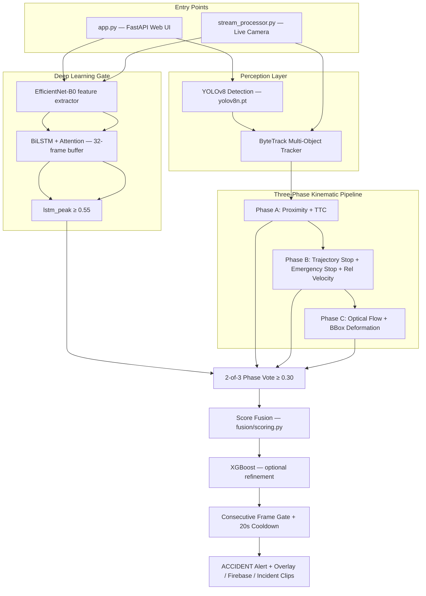

# Technical Description: UYIR Spatio-Temporal Hybrid Accident Detection System

This document describes the **current** architecture, modules, algorithms, and capabilities of the Multi-Stage Spatio-Temporal Hybrid Accident Detection System.

All tunable thresholds live in [`config.py`](config.py). Do not hardcode values in other files.

---

## 1. System Overview

The system is an Intelligent Transportation System (ITS) pipeline that identifies road accidents from CCTV video, uploaded files, and still images. It fuses:

- **Heuristic geometric-kinematic reasoning** (Phases A–C)
- **Deep learning as a hard gate** (EfficientNet-B0 + BiLSTM + Attention)
- **Optional XGBoost refinement** (trained from labeled web UI features)
- **Alert gating** (consecutive-frame confirmation + cooldown)

Both entry points share the same **Option 2** decision logic:

| Entry point | File | Use case |
|-------------|------|----------|
| Web dashboard | `app.py` | Upload images/videos, SSE streaming preview, train XGBoost, view incidents |
| Live stream | `stream_processor.py` | Webcam, RTSP camera, or video file with Firebase upload |



### Option 2 decision pipeline

Used identically in `app.py`, `_process_video_streaming()`, and `accident_detector.py`:

1. **DL inference** — Extract per-frame EfficientNet-B0 features; maintain a 32-frame rolling buffer padded with the **last** frame (not the first). Run BiLSTM + Attention → `cnn_lstm_prob`.
2. **Rolling peak** — `lstm_peak = max(last 30 scores)` only after `DL_WARMUP_FRAMES` (16) frames; before warmup, use raw per-frame probability.
3. **DL gate** — Proceed only if `lstm_peak ≥ DL_GATE_THRESHOLD` (0.55).
4. **Phase signals** — Compute per-frame scores:
   - Phase A: `ttc_score` (proximity + TTC)
   - Phase B: `max(trajectory_stop_score, emergency_stop_score, relative_velocity_score)`
   - Phase C: `optical_flow_score` (Phase C anomaly score)
5. **2-of-3 vote** — Count phases with score ≥ `DL_PHASE_SIGNAL_MIN` (0.30). Need ≥ 2.
6. **Fusion** — `fuse_scores()` with congestion suppression. Confirmed frame score = `max(fusion_score, lstm_peak × 0.80)`.
7. **XGBoost refinement** (optional) — When loaded and DL + 2 phases confirmed: boost or penalize score based on XGB probability.
8. **Risk zone** — 1.15× multiplier when collision center falls in the middle 50% of the frame.
9. **Consecutive gate** — Require `CONSECUTIVE_FRAMES` (3) sustained confirmations.
10. **Cooldown** — Suppress repeat alerts for `COOLDOWN_SECONDS` (20 s).

Detection status labels during video processing: `scanning` (DL gate not cleared), `confirmed` (DL + ≥2 phases), `suspicious` (DL + 1 phase), `suppressed` (DL + 0 phases).

---

## 2. Project Directory Structure

```
accident-system/
├── app.py                      # FastAPI web server (main web entry point)
├── stream_processor.py         # Live camera / RTSP pipeline entry point
├── config.py                   # All thresholds, weights, and paths
├── model.py                    # EfficientNet-B0 + BiLSTM + Attention classifier
├── accident_detector.py        # Stream pipeline engine (Option 2 logic)
├── data_logger.py              # CSV factor logger for threshold tuning
├── threshold_analyzer.py       # Plots CSV and suggests config updates
├── firebase_uploader.py        # Async Firebase / local JSON event upload
├── health_monitor.py           # Pi health heartbeat (FPS, CPU, RAM)
├── llm_vision_module.py        # Optional Ollama LLaVA description of accident frame
│
├── detection/
│   └── yolo_module.py          # YOLOv8 wrapper (person + vehicle classes)
│
├── tracking/
│   ├── deepsort_module.py      # ByteTrack tracker for app.py (Track objects)
│   └── vehicle_tracker.py      # ByteTrack tracker for stream pipeline (TrackedVehicle)
│
├── phases/
│   ├── phase_a_proximity.py    # Phase A: distance + TTC gate
│   ├── phase_b_trajectory.py   # Phase B: IITH stop, emergency stop, rel velocity
│   └── phase_c_anomaly.py      # Phase C: flow spike, deformation, dispersion
│
├── fusion/
│   └── scoring.py              # Research-backed weighted fusion engine
│
├── utils/
│   ├── geometry.py             # Distance, TTC, line intersection, angles
│   ├── optical_flow.py         # Farneback flow, frame diff, dispersion
│   ├── incident_clip.py        # Extract ±5 s incident clips from video
│   └── incident_store.py       # Local incident index and file management
│
├── templates/
│   └── index.html              # Web dashboard UI
│
├── static/uploads/             # Processed images, videos, incident clips
├── model_output/               # CNN-LSTM checkpoint, XGBoost model
├── accident_features.csv       # Labeled features for XGBoost training (web UI)
└── uyir_data_log.csv           # Raw factor log for threshold tuning (data_logger.py)
```

> **Note:** The `claude files/` folder contains outdated copies of early modules. Use the root-level files listed above.

---

## 3. Core Modules & Processing Pipeline

### Module 1: Object Detection

* **File**: `detection/yolo_module.py`
* **Technology**: YOLOv8 (`ultralytics`), model `yolov8n.pt`
* **Target classes** (COCO IDs):

  | Class ID | Label |
  |----------|-------|
  | 0 | person |
  | 2 | car |
  | 3 | bike |
  | 5 | bus |
  | 7 | truck |

* **Confidence threshold**: `0.15` (`config.VEHICLE_CONF_THRESHOLD`)
* **Outputs**: Bounding boxes `[x1, y1, x2, y2]`, class label, confidence score

Person detection supports vehicle–pedestrian accident scenarios (tighter proximity threshold in Phase A).

---

### Module 2: Multi-Object Tracking (MOT)

* **Web app tracker**: `tracking/deepsort_module.py` — class `ByteTrackTracker` (aliased as `VehicleTracker`)
* **Stream tracker**: `tracking/vehicle_tracker.py` — class `VehicleTracker` with `TrackedVehicle` objects

Both use **YOLOv8 built-in ByteTrack** (`tracker="bytetrack.yaml"`, `persist=True`).

| Parameter | Value | Config key |
|-----------|-------|------------|
| Track history length | 30 frames | `TRACK_HISTORY_FRAMES` |
| Lost-track timeout | 30 frames | `TRACK_LOST_TIMEOUT` |
| Detection confidence | 0.15 | `VEHICLE_CONF_THRESHOLD` |

Each tracked object maintains:
* Centroid history (trajectory path)
* Velocity vectors `(vx, vy)` per frame
* Speed history (magnitude of velocity)
* Bounding box history (for deformation checks)

---

### Phase A: Proximity + Time-To-Collision (TTC)

* **File**: `phases/phase_a_proximity.py`
* **Purpose**: High-speed gatekeeper — only pairs that are close **and converging** proceed to Phase B

**Mechanism:**

1. **Euclidean distance** between centroids:
   $$d = \sqrt{(x_2 - x_1)^2 + (y_2 - y_1)^2}$$

2. **Pair-specific proximity threshold**:
   * Vehicle–vehicle: `150 px` (`PROXIMITY_THRESHOLD`)
   * Vehicle–person: `80 px` (`PROXIMITY_PERSON_THRESHOLD`)

3. **Time-To-Collision (TTC)** — computed in `utils/geometry.py`:
   * Relative closing speed must exceed `0.5 px/frame` (`TTC_MIN_CLOSING_SPEED`)
   * Pair must have TTC `< 8 frames` (`TTC_MAX_FRAMES`)
   * Parallel traffic (not converging) returns TTC = ∞ and is correctly ignored

4. **TTC score**: $\text{ttc\_score} = \max(0,\ 1 - \text{ttc}/8)$

5. **Static image fallback**: When velocity history is unavailable (single-frame image upload), distance-only gating is used.

**Output**: List of `(track1, track2, distance, ttc_score)` candidate pairs.

---

### Phase B: Trajectory Conflict Analysis

* **File**: `phases/phase_b_trajectory.py`
* **Purpose**: Distinguish real collisions from normal junction crossings and occlusions

**Recently-moving guard** — A pair is skipped only when **both** tracks are stationary **and neither** was recently moving (`was_recently_moving()` checks peak speed > 3.0 px/frame in the last 15 frames). This preserves post-crash detection when both vehicles have already stopped.

**Signals checked for each Phase A candidate pair:**

| Signal | Function | Description |
|--------|----------|-------------|
| Trajectory intersection | Line segment intersection on 15-frame history | Paths crossed in recent frames |
| **Trajectory stop (IITH 2018)** | `check_trajectory_stop_after_intersection()` | After intersection, one vehicle's speed drops from >3.0 to <2.0 px/frame |
| **Emergency stop** | `is_emergency_stop()` | 75%+ speed drop over 15-frame baseline in ≤3 frames; evaluated **independently** of path intersection |
| **Relative velocity anomaly** | `relative_velocity_anomaly()` | Speed difference was >8.0 px/frame, now <2.0 — rear-end convergence |
| Kinetic energy drop | `check_ke_drop()` | Area × speed² drops >80%; uses emergency stop when applicable |
| Spin / skid | `check_spin()` | Circular variance of heading >0.15 over 5 frames |
| BBox merge | IoU > 0.60 | Two vehicles overlap as one box |
| Occlusion | Containment ratio > 0.60 | Smaller vehicle hidden inside larger |

**Classification rules:**

* **Collision**: `(intersection + trajectory_stop) OR emergency_stop OR relative_velocity_converged OR merge OR spin`
* **Occlusion**: Intersection or containment without collision signals — score suppressed (~0.20–0.30)
* **Normal**: No significant conflict

Intersection alone does **not** trigger a collision — this is the key fix for dense Indian junction traffic.

---

### Phase C: Anomaly Confirmation

* **File**: `phases/phase_c_anomaly.py`
* **Helpers**: `utils/optical_flow.py`

| Signal | Threshold | Description |
|--------|-----------|-------------|
| Optical flow magnitude spike | >2.5× rolling average (and >4.0 absolute) | Sudden motion inside bbox |
| BBox deformation | Aspect ratio >30% or area >40% change | Rollover, tilt, crash deformation |
| Flow angular dispersion | Circular variance >0.50 | Chaotic radial scatter vs parallel traffic |
| Multi-frame consistency | ≥3 consecutive frames | Filters camera noise and lighting flicker |

Anomaly score blends flow magnitude (40%), deformation (30%), and dispersion (30%). Confirmed anomalies are boosted to ≥0.70.

---

### CNN-LSTM Deep Learning Module (Hard Gate)

* **File**: `model.py`
* **Architecture**: EfficientNet-B0 (1280-dim features) → 2-layer BiLSTM (256 hidden, bidirectional) → Attention → 2-class classifier
* **Sequence length**: 32 frames (`SEQUENCE_LEN`)
* **Execution**: Feature caching — CNN runs once per frame; rolling buffer fed to BiLSTM (much faster than raw frame input)
* **Checkpoint**: `model_output/accident_model.pth`
* **Input transform**: Resize 240×240, ImageNet normalization

**DL gate behavior** (not a fusion contributor):

| Config key | Value | Purpose |
|------------|-------|---------|
| `DL_GATE_THRESHOLD` | 0.55 | `lstm_peak` must reach this to open the gate |
| `DL_WARMUP_FRAMES` | 16 | Don't trust rolling peak before this many frames |
| `DL_PHASE_SIGNAL_MIN` | 0.30 | Phase score threshold for the 2-of-3 vote |
| `FUSION_WEIGHTS["cnn_lstm"]` | 0.0 | Gate only — not a weighted contributor |

**Padding fix**: During warmup, the sequence buffer is padded with the **last** extracted feature (matching `model.py` training inference), not the first frame.

---

### XGBoost Classifier (Optional Refinement)

* **File**: `model_output/accident_xgboost.json`
* **Training data**: `accident_features.csv` (logged via web UI `/log-feature`)
* **Training endpoint**: `POST /train-model`
* **Minimum dataset**: 50 rows per class before the model is loaded at startup
* **Usage**: When DL gate + 2 phases are confirmed, XGBoost probability refines the frame score (boost if ≥0.35, penalize ×0.7 if <0.35). Does **not** replace the Option 2 pipeline.

Feature vector (10 columns): proximity, trajectory, anomaly, cnn, occlusion, merge, kinetic, density, avg_speed, stopped_ratio, label.

---

## 4. Weighted Score Fusion Engine

* **File**: `fusion/scoring.py`
* **Config**: `config.FUSION_WEIGHTS`, `config.FUSION_THRESHOLD` (default `0.55`)

$$\text{Final Score} = \sum_{k} w_k \cdot s_k$$

| Weight | Signal | Description |
|--------|--------|-------------|
| **0.45** | Trajectory stop | IITH post-intersection stop — most precise signal |
| **0.25** | Emergency stop | Sudden deceleration from Phase B |
| **0.15** | TTC critical | Time-To-Collision score from Phase A |
| **0.10** | Optical flow | Phase C flow magnitude spike |
| **0.05** | Flow dispersion | Phase C angular scatter |
| **0.00** | CNN-LSTM | Hard gate only — not a weighted contributor |

**Congestion gate**: When traffic density >40% and average scene speed <5 px/frame (or stopped ratio >60%), proximity/TTC/trajectory/emergency signals are suppressed by 90% **unless** collision signals are already present (trajectory_stop > 0.3, emergency_stop > 0.3, or cnn_lstm > 0.4).

**Decision**: After Option 2 vote passes, confirmed frame score = `max(fusion_score, lstm_peak × 0.80)`.

---

## 5. Alert Gating (False Positive & Spam Prevention)

Applied in `app.py` (video/streaming) and `accident_detector.py` (live stream):

| Gate | Value | Config key | Purpose |
|------|-------|------------|---------|
| Consecutive frame confirmation | 3 frames | `CONSECUTIVE_FRAMES` | Require sustained agreement before alert |
| Camera cooldown | 20 seconds | `COOLDOWN_SECONDS` | Suppress repeat alerts for same ongoing accident |

On confirmed accident, the system saves:
* Snapshot JPEG
* ±5 s incident clip (`CLIP_SECONDS_BEFORE` / `CLIP_SECONDS_AFTER`)
* Optional LLM analysis via `llm_vision_module.py`
* Firebase upload (async) or local JSON fallback via `incident_store.py`

---

## 6. Entry Point: Web Application (`app.py`)

FastAPI server with Jinja2 dashboard at `http://127.0.0.1:8000`.

### API Endpoints

| Method | Path | Description |
|--------|------|-------------|
| GET | `/` | Dashboard UI (`templates/index.html`) |
| POST | `/predict-image` | Upload image → detection + proximity + DL + fusion/XGBoost |
| POST | `/predict-video` | Upload video → Option 2 pipeline, annotated MP4, incident clips |
| POST | `/start-stream` | Start background video job; returns `job_id` for SSE |
| GET | `/stream/{job_id}` | Server-Sent Events stream of JPEG frames + metrics + incidents |
| GET | `/api/incidents` | List saved incident records |
| DELETE | `/api/incidents/{id}` | Delete an incident record |
| GET | `/api/firebase/status` | Firebase connection and storage mode |
| POST | `/log-feature` | Append labeled feature row to `accident_features.csv` |
| POST | `/train-model` | Train XGBoost from CSV and save to `model_output/` |
| GET | `/dataset-status` | Row counts and XGBoost active status |

### Video processing loop (per frame)

1. Resize frame (max width 800 px), process every 2nd frame
2. ByteTrack update → active tracks
3. EfficientNet-B0 feature extraction → 32-frame BiLSTM buffer → `cnn_lstm_prob` + `lstm_peak`
4. Optical flow computation
5. Phase A → Phase B → Phase C scoring
6. Option 2: DL gate → 2-of-3 phase vote → `fuse_scores()` → optional XGBoost refinement
7. Intersection risk zone multiplier (1.15× for center 50% of frame)
8. Consecutive frame gate + cooldown check
9. Draw annotations, telemetry panel, write H.264 MP4 (`avc1`)
10. On confirmed accident: save snapshot, extract incident clip, optional LLM analysis, Firebase upload

### Image processing

Static images use YOLO detection (no tracking history). Scoring combines proximity, occlusion, and DL probability. If `cnn_lstm_prob < 0.40`, result is forced to NO ACCIDENT.

### Telemetry panel

Displays per frame: DL gate status, TTC Critical, Trajectory Stop, Emergency Stop, Relative Velocity, Optical Flow, Flow Dispersion, Spin/Merge, consecutive frame counter, and detection status.

---

## 7. Entry Point: Live Stream Pipeline (`stream_processor.py`)

For deployment on Raspberry Pi or server with a live camera feed.

```
Camera/RTSP → VehicleTracker (ByteTrack)
            → AccidentDetector (Option 2: DL gate + Phases A/B/C + Fusion)
            → Consecutive frame gate + Cooldown
            → Incident clip buffer (±5 s)
            → FirebaseUploader (async) or local JSON fallback
            → HealthMonitor (30s heartbeat)
```

| Component | File |
|-----------|------|
| Tracker | `tracking/vehicle_tracker.py` |
| Detector | `accident_detector.py` |
| Cloud upload | `firebase_uploader.py` |
| Health heartbeat | `health_monitor.py` |
| Incident clips | `utils/incident_clip.py`, `utils/incident_store.py` |

Optional Stage-1 YOLO accident model (`accident_model.pt`) gates frames before 3-phase verification if the file exists (`STAGE1_GATE_CONFIDENCE = 0.65`); otherwise Option 2 runs directly.

**Run:**
```bash
python stream_processor.py --source 0                          # webcam
python stream_processor.py --source rtsp://IP:PORT/stream       # RTSP
python stream_processor.py --source video.mp4 --no_display      # headless
```

---

## 8. Threshold Tuning Tools

| Tool | File | Usage |
|------|------|-------|
| Data logger | `data_logger.py` | `python data_logger.py --video clip.mp4 --label accident` |
| Threshold analyzer | `threshold_analyzer.py` | `python threshold_analyzer.py --csv uyir_data_log.csv` |

The data logger writes per-vehicle, per-frame raw factors to `uyir_data_log.csv` (config: `DATA_LOG_CSV`): speed, speed drop, nearest distance, IoU, trajectory deviation, bbox area change, optical flow ratio, and optional Stage-1 accident model confidence.

The analyzer plots accident vs normal distributions and prints suggested updates for `config.py` (`PROXIMITY_THRESHOLD`, `SPEED_DROP_PERCENT`, `OPTICAL_FLOW_SPIKE`, etc.).

---

## 9. Configuration Reference (`config.py`)

Key parameters for Coimbatore junction cameras (defaults):

```python
PROXIMITY_THRESHOLD        = 150    # px, vehicle-vehicle
PROXIMITY_PERSON_THRESHOLD = 80     # px, vehicle-person
TTC_MAX_FRAMES             = 8       # frames until contact
VEHICLE_CONF_THRESHOLD     = 0.15    # YOLO detection confidence
TRACK_LOST_TIMEOUT         = 30      # ByteTrack grace period (frames)
EMERGENCY_BASELINE_FRAMES  = 15      # baseline for emergency stop detection
EMERGENCY_DROP_PERCENT     = 75.0    # % drop = emergency (not normal braking)
RECENTLY_MOVING_FRAMES     = 15      # post-crash stop guard window
RECENTLY_MOVING_MIN_SPEED  = 3.0     # px/frame peak to count as "recently moving"
DL_GATE_THRESHOLD          = 0.55    # DL hard gate
DL_PHASE_SIGNAL_MIN        = 0.30    # phase vote threshold
DL_WARMUP_FRAMES           = 16      # frames before trusting rolling lstm_peak
CONSECUTIVE_FRAMES         = 3       # frames required before alert
COOLDOWN_SECONDS           = 20.0    # seconds between alerts per camera
FUSION_THRESHOLD           = 0.55    # minimum fused score for accident
CLIP_SECONDS_BEFORE        = 5       # incident clip pre-roll
CLIP_SECONDS_AFTER         = 5       # incident clip post-roll
```

---

## 10. Operational Capabilities & Visual Feedback

When an accident is identified, the system produces:

1. **Bounding boxes & track IDs** — green (moving), darker green (stationary), orange/red (anomaly)
2. **Trajectory trails** — dot history per tracked object
3. **Proximity lines** — yellow lines between TTC-critical pairs
4. **Collision centers** — red concentric circles at impact point
5. **Intersection risk zone** — white rectangle over center 50% of frame (1.15× score multiplier)
6. **Telemetry panel** — live DL gate, TTC, trajectory stop, emergency stop, flow scores
7. **Accident alert banner** — red overlay with confidence and active triggers
8. **Processed output** — H.264 MP4 or annotated JPEG in `static/uploads/`
9. **Incident clips** — ±5 s MP4 clips in `static/uploads/incidents/`
10. **LLM analysis** (optional) — text description of worst accident frame via Ollama LLaVA or heuristic fallback

---

## 11. Run Commands

```bash
# Install dependencies
pip install torch torchvision numpy opencv-python fastapi uvicorn \
    ultralytics jinja2 python-multipart pillow xgboost scikit-learn pandas

# Web dashboard
python app.py
# → http://127.0.0.1:8000

# Live camera pipeline
python stream_processor.py --source 0

# Threshold tuning
python data_logger.py --video clip.mp4 --label accident
python threshold_analyzer.py --csv uyir_data_log.csv
```

Optional: `pip install firebase-admin` for cloud upload; place `firebase_key.json` in project root. Set `FIREBASE_USE_STORAGE = False` on Spark (free) plan for Firestore-only mode with embedded JPEG thumbnails.

---

## 12. Research References

| Phase / Feature | Source |
|-----------------|--------|
| Phase A proximity | NJIT 2022 |
| Phase A TTC | Physics-based closing velocity |
| Phase B trajectory stop | IITH 2018 — intersection + stop = collision; intersection alone = occlusion |
| Phase B emergency stop | Extended baseline window (15 vs 6 frames); independent of intersection |
| Phase B relative velocity | Rear-end convergence detection |
| Phase B recently-moving guard | Post-crash stop vs permanently parked vehicle |
| Phase C optical flow | HFG 2010 |
| Phase C flow dispersion | Fuzzy 2023 |
| ByteTrack | YOLOv8 built-in — occlusion-robust tracking |
| DL gate (Option 2) | EfficientNet-B0 + BiLSTM hard gate; 2-of-3 phase vote |
| Fusion weights | Research-backed; CNN-LSTM is gate-only (weight 0) |
